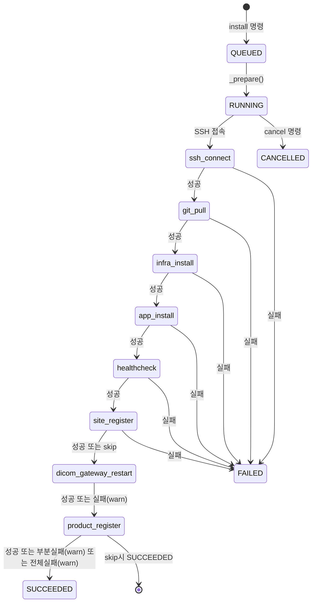
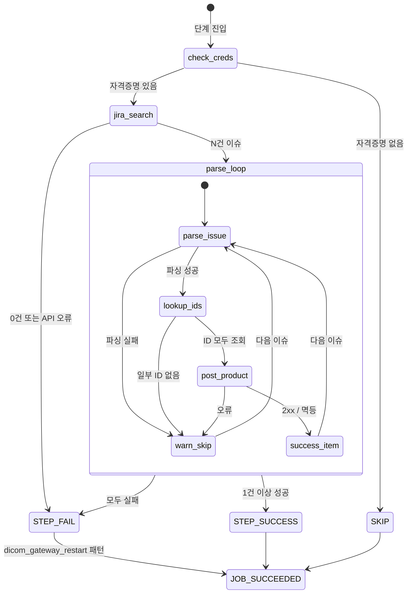

# 개발지시서 — 단계 8: product_register

- **작성자**: @planner
- **작성일**: 2026-06-01
- **버전**: v1.0
- **연결 스펙**: `docs/specs/dev-spec-autodeploy-mvp-20260521.md` (기존 워크플로 기반)
- **상태**: 초안 (구현 전 용혁 컨펌 필요 — §9 결정 필요 항목 참고)

---

## 1. 배경 / 문제

현재 워크플로는 7단계(dicom_gateway_restart)까지 완료된 뒤 종료된다. 각 병원 납품에는 KOA, Spin, Metric 등 여러 제품이 동시에 포함되는데, 이 제품 정보를 백엔드 Product API에 등록하는 작업이 아직 수동이다.

제품 등록에 필요한 정보는 두 곳에 분산되어 있다:
- **Jira(생산관리 프로젝트)**: 제품명, 라이센스 정보, GS1 바코드, 병원명 — 이슈 1건당 제품 1건
- **백엔드 Lookup API**: siteId, productCodeId, gatewayVersionId, aiEngineVersionId, isVersionId

product_register 단계는 이 두 소스를 조합하여 자동으로 백엔드 Product API에 등록함으로써 반복적인 수동 입력 작업을 제거한다.

---

## 2. 목표 / 비목표

### 목표
1. dicom_gateway_restart(7단계) 직후 **8번째 단계**로 product_register 실행
2. Jira에서 해당 병원의 제품 이슈 목록 자동 조회 (JQL: 병원 displayName 기반)
3. 이슈 1건당 백엔드 Lookup API로 ID 조회 후 `POST /api/v1/products` 1회 호출
4. N개 제품 중 일부 실패 시 나머지는 계속 진행 (부분 성공 허용)
5. JIRA_EMAIL/JIRA_API_TOKEN 미설정 시 단계 전체 조용히 skip (site_register와 동일 패턴)

### 비목표
- 이미 등록된 제품 정보 수정·삭제 (등록만)
- Jira 이슈 상태 변경 (조회 전용)
- 버전 수동 지정 (항상 최신 버전 자동 선택)
- hybrid / on-premise 분기 없음 — 모든 deployment_type에 동일하게 실행
- 제품 등록 후 검증 (등록 결과 정합성 확인은 운영자 몫)

---

## 3. 유저 스토리

| ID | 역할 | 시나리오 |
|----|------|---------|
| US-8-1 | 운영자(용혁) | install 명령 한 번으로 설치 → 병원 등록(site_register) → 제품 등록(product_register)까지 자동으로 완료된다. Slack에서 "단계 8/8 제품 등록 완료 (KOA, Spin, Metric)" 메시지를 확인한다. |
| US-8-2 | 운영자(용혁) | KOA 등록은 성공하고 Spin은 Jira 파싱 오류로 실패한 경우, 봇이 실패 항목만 warn으로 기록하고 나머지는 성공 처리한다. 실패한 제품명과 원인이 Slack 스레드에 표시된다. |
| US-8-3 | 운영자(용혁) | .env에 JIRA_EMAIL/JIRA_API_TOKEN이 없는 상태에서 install하면 product_register 단계가 표시 없이 skip되고 나머지 7단계는 정상 완료된다. |
| US-8-4 | 엔지니어 | Jira 이슈에 취소선(strike-through)으로 지워진 GS1 바코드가 있는 경우, 활성(취소선 없는) 바코드만 사용한다. |

---

## 4. 기능 요구사항

### F8-1: 단계 등록 및 skip 조건

| ID | 요구사항 |
|----|---------|
| F8-1.1 | `Step` enum에 `PRODUCT_REGISTER = "product_register"` 추가. `STEPS_IN_ORDER`는 `DICOM_GATEWAY_RESTART` 다음(8번째)에 배치 |
| F8-1.2 | `JIRA_EMAIL` 또는 `JIRA_API_TOKEN`이 비어있으면 단계 시작 알림 없이 조용히 return (skip). `site_register`의 자격증명 미설정 skip과 동일 패턴 |
| F8-1.3 | site_register 단계가 자격증명 미설정으로 skip된 경우 토큰이 없으므로 Lookup API 호출 불가 → product_register도 skip. 구체적으로: `cfg.site_admin_email` 또는 `cfg.site_admin_password` 비어있으면 skip |
| F8-1.4 | skip인 경우 `STEPS_IN_ORDER`에 포함되어 "단계 N/8" 표기는 유지하되, step_started 이벤트는 발행하지 않음 (Slack에 표시 없음) |

### F8-2: Jira 이슈 검색

| ID | 요구사항 |
|----|---------|
| F8-2.1 | Base URL: `JIRA_BASE_URL` env (기본값 `https://connecteve.atlassian.net`). `.env`로 override 가능 |
| F8-2.2 | 인증: HTTP Basic auth. username = `JIRA_EMAIL`, password = `JIRA_API_TOKEN` |
| F8-2.3 | Project key: `JIRA_KEY` env (기본값 `PMFM`) |
| F8-2.4 | JQL: `project = "<JIRA_KEY>" AND summary ~ "[<hospital_display_name>]"` 형태로 검색. `hospital_display_name`은 `job.hospital_name or job.hospital_code` |
| F8-2.5 | 이슈 검색 응답에서 `fields.summary`, `fields.description` (ADF JSON 포맷) 추출 |
| F8-2.6 | 결과 0건이면 단계 실패 (skip이 아닌 step failure). warn 이벤트: "Jira 이슈를 찾지 못함 (병원: {name})" |
| F8-2.7 | 페이지네이션: 첫 페이지 결과로 처리. 향후 이슈 건수가 많아질 경우 전체 순회로 변경 가능하도록 함수 인터페이스를 열어둠 (결정 필요 항목 D8-3 참고) |

### F8-3: Jira 이슈 파싱

| ID | 요구사항 |
|----|---------|
| F8-3.1 | **summary 파싱**: `[<병원명>] CONNEVO <productName> <version>` 형태에서 `productName` 추출. 정규식: `\[.*?\]\s+CONNEVO\s+(\S+)` |
| F8-3.2 | **description ADF 파싱**: description은 Atlassian Document Format(ADF) JSON. 텍스트 노드를 평탄화(flatten)하여 줄 단위로 처리. `marks` 배열에 `{"type": "strike"}` 포함 텍스트는 무시 |
| F8-3.3 | **목적 파싱**: `목적:` 으로 시작하는 줄에서 라이센스 타입 추출. 매핑 테이블 (config 또는 코드 상수): `데모` → `Demo`. 알 수 없는 값은 원문 그대로 사용하고 warn 이벤트 기록 |
| F8-3.4 | **서버 파싱**: `서버:` 로 시작하는 줄에서 `pcSerialNumber` 추출. 해당 줄 없거나 비어있으면 빈 문자열 |
| F8-3.5 | **라이센스 기간 파싱**: `기간:` 으로 시작하는 줄에서 `startDate`/`endDate` 추출. 형식: `YYYY년 M월 D일 ~ YYYY년 M월 D일`. ISO 8601 (`YYYY-MM-DD`)로 변환 |
| F8-3.6 | **N수 파싱**: `N수:` 로 시작하는 줄에서 `licenseLimit` 추출. 한글 숫자 파싱: `만` = 10,000, `억` = 100,000,000, `천` = 1,000. 예: `20만장` → 200,000. 단위 조합 가능성 고려 (결정 필요 D8-4) |
| F8-3.7 | **GS1 바코드 파싱**: ADF에서 텍스트 평탄화 후 `(01)` 으로 시작하는 줄을 GS1 바코드로 인식. 취소선(`strike` mark) 없는 줄만 사용. 활성 바코드가 2개 이상이면 첫 번째 사용 (결정 필요 D8-5) |
| F8-3.8 | **GS1 segment 파싱**: `(NN)value` 형태의 연속 segment 분리. 추출 대상: `(11)` → mfgDate, `(20)` → variant, `(21)` → serialNumber, `(APP)` → productName (매칭 키로 사용) |
| F8-3.9 | 필수 필드 누락(GS1 없음, 기간 파싱 실패 등) 시 해당 이슈를 warn 이벤트로 기록하고 skip. 나머지 이슈는 계속 처리 (부분 성공) |

### F8-4: 백엔드 Lookup API 호출

| ID | 요구사항 |
|----|---------|
| F8-4.1 | 인증 헤더: `x-auth-token` (site_register에서 사용한 토큰 재사용). `x-api-env` 헤더 포함. Base URL: `cfg.site_cloud_base_url` |
| F8-4.2 | **siteId 조회**: `GET /api/v1/sites`. 응답 `data.content[]`에서 `name == job.hospital_code` 매칭. 매칭 없으면 해당 이슈 warn + skip |
| F8-4.3 | **productCodeId 조회**: `GET /api/v1/products/product-codes`. 응답 `data[]`에서 `name == <productName>` 대소문자 정확히 매칭. 매칭 없으면 해당 이슈 warn + skip |
| F8-4.4 | **gatewayVersionId 조회**: `GET /api/v1/products/gateway-version`. 응답 `data[]`에서 semver 정렬 후 최신 1건의 `id` 추출. modal 필터 없음 |
| F8-4.5 | **aiEngineVersionId 조회**: `GET /api/v1/products/ai-engine-version?modal=<productName>`. 응답 `data[]`에서 최신 version `id` 추출 |
| F8-4.6 | **isVersionId 조회**: `GET /api/v1/products/inference-server-version`. 응답 `data[]` 전체에서 클라이언트 측 `modal == <productName>` 필터 후 최신 version `id` 추출 |
| F8-4.7 | version 비교: semver(`packaging.version.Version` 또는 순수 문자열 split 비교). 결정 필요 D8-6 |
| F8-4.8 | 각 Lookup API 호출에서 매칭 결과 0건이면 해당 이슈 warn + skip |
| F8-4.9 | Lookup API는 이슈별로 반복 호출하지 않고 **이슈 처리 전 최초 1회 캐싱**. siteId만 이슈와 무관(job 단위)하고, gateway/ai-engine/is 버전은 제품명별로 캐싱 |

### F8-5: Product POST 호출

| ID | 요구사항 |
|----|---------|
| F8-5.1 | `POST {site_cloud_base_url}/api/v1/products`. 헤더: `x-auth-token`, `x-api-env`, `Content-Type: application/json` |
| F8-5.2 | 요청 바디: 아래 §6 데이터 흐름도 참고 |
| F8-5.3 | 멱등성: 409 또는 body에 `duplicate`/`already`/`exist` 키워드 포함 4xx는 `already_exists`로 정상 처리 (site_register 패턴 재사용) |
| F8-5.4 | 성공(2xx 또는 already_exists) 시 이벤트 기록: `"[{productName}] 등록 완료"` 또는 `"[{productName}] 이미 등록됨 (멱등)"` |
| F8-5.5 | 실패(그 외 4xx/5xx, 타임아웃) 시 해당 제품 warn 이벤트 기록 후 다음 이슈 계속 |

### F8-6: 단계 결과 판정

| 상황 | step result | job 전체 result |
|------|------------|----------------|
| 모든 이슈 등록 성공 | success | SUCCEEDED |
| 일부 이슈 실패 (1개 이상 성공) | success + warn 이벤트 | SUCCEEDED |
| 모든 이슈 실패 | failure | SUCCEEDED (dicom_gateway_restart 패턴) |
| Jira 검색 자체 실패 (0건 또는 API 오류) | failure | SUCCEEDED |
| skip (자격증명 미설정) | (단계 미표시) | SUCCEEDED |

### F8-7: 비기능 요구사항

| ID | 요구사항 |
|----|---------|
| F8-7.1 | Jira API, Lookup API, Product POST API 각 호출 타임아웃: 15초 (aiohttp.ClientTimeout total) |
| F8-7.2 | 단계 전체 타임아웃: 결정 필요 (D8-7). 기본안 5분 |
| F8-7.3 | 민감 정보(JIRA_API_TOKEN)는 .env에서만 로드. 로그/Slack 출력에 포함 금지 (`mask_url_secrets` 패턴 적용 여부 검토) |
| F8-7.4 | 모든 Lookup API 응답은 메모리 캐시 (동일 단계 실행 내에서만). 프로세스 재시작 후 재조회 |

---

## 5. 데이터 흐름도

```
[_step_product_register] 진입
        |
        |-- JIRA_EMAIL/TOKEN 없음 → skip (return, 알림 없음)
        |-- site_admin 자격증명 없음 → skip (return, 알림 없음)
        |
        v
[jira_client.search_issues(jql)]
  GET https://connecteve.atlassian.net/rest/api/3/search
  JQL: project=PMFM AND summary~"[<hospital_display_name>]"
        |
        |-- 0건 → step failure, job SUCCEEDED
        |-- API 오류 → step failure, job SUCCEEDED
        |
        v (N개 이슈)
[product_registration.fetch_lookup_ids(token)]
  캐싱 조회 (job 단위 1회):
    GET /api/v1/sites                             → siteId
  캐싱 조회 (product_name 단위):
    GET /api/v1/products/product-codes            → productCodeId
    GET /api/v1/products/gateway-version          → gatewayVersionId (최신)
    GET /api/v1/products/ai-engine-version?modal= → aiEngineVersionId (최신)
    GET /api/v1/products/inference-server-version → isVersionId (클라이언트 필터, 최신)
        |
        v (이슈별 반복)
[jira_description_parser.parse(issue)]
  summary → productName
  description ADF → pcSerialNumber, licenseType, startDate, endDate, licenseLimit
  description ADF → 활성 GS1 바코드 → mfgDate, variant, serialNumber
        |
        |-- 필수 필드 누락 → warn 이벤트, 이슈 skip
        |
        v
[product_registration.post_product(body, token)]
  POST /api/v1/products
  body:
  {
    "siteId": <lookup>,
    "productCodeId": <lookup>,
    "gatewayVersionId": <latest>,
    "aiEngineVersionId": <latest for modal>,
    "isVersionId": <latest for modal>,
    "serialNumber": <GS1 (21)>,
    "pcSerialNumber": <Jira 서버: 줄>,
    "variant": <GS1 (20)>,
    "mfgDate": <GS1 (11)>,
    "license": {
      "licenseType": <매핑: 데모→Demo>,
      "startDate": <YYYY-MM-DD>,
      "endDate": <YYYY-MM-DD>,
      "licenseLimit": <정수>
    }
  }
        |
        |-- 2xx / 멱등(409/duplicate) → "등록 완료" or "이미 등록됨"
        |-- 그 외 실패 → warn 이벤트, 다음 이슈 계속
        v
모든 이슈 처리 완료 → _step_done(success=True or False)
  (하나라도 실패했으면 success=False, 단 job 전체는 SUCCEEDED 유지)
```

---

## 6. DB 스키마 변경

### 스키마 변경 없음

기존 `job_events` 테이블에 `step = 'product_register'`로 이벤트를 기록한다. 테이블 구조는 변경하지 않는다.

| 컬럼 | 기존 타입 | 비고 |
|------|---------|------|
| job_id | INTEGER FK | 기존 |
| step | TEXT | 'product_register' 값 추가 (enum 변경 없이 TEXT 그대로) |
| level | TEXT | 'info' / 'warn' / 'error' |
| message | TEXT | "[KOA] 등록 완료" 등 제품 단위 메시지 |

### 코드 변경: models.py

```
Step.PRODUCT_REGISTER = "product_register"   # DICOM_GATEWAY_RESTART 다음에 추가
STEPS_IN_ORDER: 8개로 확장
```

### 코드 변경: settings.py

신규 env vars:

| env var | 기본값 | 설명 |
|---------|--------|------|
| `JIRA_BASE_URL` | `https://connecteve.atlassian.net` | Jira Cloud 인스턴스 URL |
| `JIRA_EMAIL` | `""` (옵션) | Basic auth username |
| `JIRA_API_TOKEN` | `""` (옵션) | Basic auth password |
| `JIRA_KEY` | `PMFM` | Jira project key |

### 코드 변경: .env.example

```
# Jira (생산관리 프로젝트) — product_register 단계용
# 비워두면 product_register 단계를 skip
JIRA_BASE_URL=https://connecteve.atlassian.net
JIRA_EMAIL=
JIRA_API_TOKEN=
JIRA_KEY=PMFM
```

---

## 7. 상태 / 이벤트 모델

### 7-1. 전체 워크플로 상태 전이 (8단계)



### 7-2. product_register 단계 내부 상태



### 7-3. job_events 기록 패턴

| 이벤트 | level | message 예시 |
|--------|-------|-------------|
| 단계 시작 | info | "started" |
| 이슈 파싱 실패 | warn | "[KOA] description에서 GS1 바코드를 찾지 못함" |
| Lookup ID 없음 | warn | "[Spin] product-codes에서 'Spin' 매칭 없음" |
| 등록 성공 | info | "[KOA] 등록 완료" |
| 멱등 처리 | info | "[KOA] 이미 등록됨 (멱등)" |
| POST 실패 | warn | "[Metric] POST 실패 (HTTP 500): ..." |
| Jira 검색 실패 | error | "Jira 검색 실패: ..." |
| 단계 완료 | info/error | "finished (12.3s)" / "failed (5.1s)" |

---

## 8. 에러 / 엣지케이스

| # | 시나리오 | 원인 | 대응 |
|---|---------|------|------|
| E1 | Jira 인증 실패 (401) | JIRA_EMAIL/TOKEN 오류 | step failure. warn 이벤트: "Jira 인증 실패 — JIRA_EMAIL/JIRA_API_TOKEN 확인". job은 SUCCEEDED 유지 |
| E2 | Jira 이슈 0건 | 병원 displayName이 이슈 summary와 불일치 | step failure. warn 이벤트: 병원명 + JQL 표시 |
| E3 | summary 형식 불일치 | `[병원명] CONNEVO <name>` 패턴 아님 | 해당 이슈 warn + skip. 나머지 계속 |
| E4 | description에 GS1 바코드 없음 | 이슈 미완성 또는 형식 변경 | 해당 이슈 warn + skip |
| E5 | 활성 GS1 바코드 전부 취소선 처리 | 이슈 작성자가 취소 표시 | 해당 이슈 warn + skip |
| E6 | 한글 날짜 파싱 실패 | 형식 변형 (예: "2026. 5. 7") | 해당 이슈 warn + skip. 결정 필요 D8-4 |
| E7 | siteId 매칭 없음 | site_register 미완료 또는 hospital_code 불일치 | 해당 이슈 warn + skip |
| E8 | productCodeId 매칭 없음 | 백엔드에 해당 product-code 미등록 | 해당 이슈 warn + skip. 백엔드 admin에서 수동 등록 필요 |
| E9 | gatewayVersionId 결과 없음 | Lookup API 빈 배열 반환 | 해당 이슈 warn + skip |
| E10 | aiEngineVersionId / isVersionId 결과 없음 | 특정 modal 버전 미등록 | 해당 이슈 warn + skip |
| E11 | Product POST 409 또는 duplicate 키워드 | 이미 등록된 제품 재시도 | already_exists로 정상 처리 (warn 아님) |
| E12 | Product POST 5xx | 백엔드 오류 | 해당 이슈 warn + skip. 단계 failure는 아님 |
| E13 | Jira API 타임아웃 (15s 초과) | 네트워크 지연 또는 Jira 부하 | step failure. job SUCCEEDED 유지 |
| E14 | Lookup API 타임아웃 | 백엔드 지연 | 해당 lookup warn. 가능하면 이슈 skip으로 처리 |
| E15 | site_register skip → 토큰 없음 | 자격증명 미설정 | F8-1.3에 따라 product_register도 skip |
| E16 | 활성 GS1 바코드 2개 이상 | 이슈에 복수 바코드 | 첫 번째 사용 + warn 이벤트 기록 (결정 필요 D8-5) |

---

## 9. 모듈 분할

### 신규 파일

| 파일 | 역할 |
|------|------|
| `src/autodeploy/jira_client.py` | Jira REST API v3 클라이언트. Basic auth 설정, `search_issues(jql, fields) -> list[dict]` 구현. ADF 응답 그대로 반환 (파싱은 하지 않음). aiohttp.ClientSession 재사용 패턴은 site_registration.py 참고 |
| `src/autodeploy/jira_description_parser.py` | ADF JSON → 구조화된 데이터 변환. `flatten_adf_text(adf_node, skip_strike=True) -> list[str]` (줄 단위 리스트), `parse_product_info(summary, description_adf) -> ProductInfo` 반환. `ProductInfo` dataclass 정의 포함 |
| `src/autodeploy/gs1_parser.py` | GS1 바코드 문자열 파싱. `parse_gs1(barcode: str) -> dict[str, str]`. `(APP)`, `(21)`, `(20)`, `(11)` segment 추출. 알 수 없는 segment는 무시 (forward compatibility) |
| `src/autodeploy/product_registration.py` | Lookup API 호출 및 캐싱, Product POST body 조립, POST 실행. `ProductRegistrationClient` 클래스. `register_products(job, issues, token) -> tuple[int, int]` (성공건수, 실패건수) 반환 |

### 기존 파일 변경

| 파일 | 변경 내용 |
|------|---------|
| `src/autodeploy/models.py` | `Step.PRODUCT_REGISTER` 추가, `STEPS_IN_ORDER` 8개로 확장 |
| `src/autodeploy/settings.py` | `jira_base_url`, `jira_email`, `jira_api_token`, `jira_key` 필드 추가 (모두 옵션, 기본값 있음) |
| `src/autodeploy/workflow.py` | `WorkflowConfig`에 Jira 설정 필드 추가, `_step_product_register` 메서드 추가, `_execute`에서 `_step_dicom_gateway_restart` 다음에 호출 |
| `src/autodeploy/messages.py` | `Step.PRODUCT_REGISTER` 아이콘/라벨 등록. success_summary에 제품 등록 결과 표시 (성공 N건 / 실패 N건) |
| `src/autodeploy/__main__.py` | `settings` → `WorkflowConfig` 전달 시 Jira 설정 필드 추가 |
| `.env.example` | Jira 관련 env vars 4개 추가 |

---

## 10. 테스트 계획

### 10-1. 단위 테스트: `tests/test_gs1_parser.py`

| 케이스 | 내용 |
|--------|------|
| T-GS1-1 | 전형적인 GS1 바코드에서 (11), (20), (21), (APP) 정확히 추출 |
| T-GS1-2 | 알 수 없는 segment `(Site)`, `(PV)`, `(AM)` 포함 시 무시하고 알려진 것만 반환 |
| T-GS1-3 | 빈 문자열 입력 시 빈 dict 반환 |
| T-GS1-4 | segment 값에 특수문자 포함 시 정상 파싱 |

### 10-2. 단위 테스트: `tests/test_jira_description_parser.py`

| 케이스 | 내용 |
|--------|------|
| T-ADF-1 | strike mark 있는 텍스트 노드 제외, 없는 것만 반환 |
| T-ADF-2 | 중첩 ADF 노드 (paragraph > text) 평탄화 |
| T-ADF-3 | `목적: 데모` → `licenseType = "Demo"` |
| T-ADF-4 | `목적: 알수없음` → 원문 유지 + warn flag |
| T-ADF-5 | `서버:` 줄 있음 → pcSerialNumber 추출 |
| T-ADF-6 | `서버:` 줄 없음 → pcSerialNumber = "" |
| T-ADF-7 | `기간: 2026년 4월 27일 ~ 2026년 6월 30일` → startDate/endDate ISO 변환 |
| T-ADF-8 | 날짜 형식 불일치 시 parse 오류 반환 |
| T-ADF-9 | `N수: 20만장` → 200000 |
| T-ADF-10 | `N수: 1억장` → 100000000 |
| T-ADF-11 | `N수: 2만5천장` → 25000 (복합 단위, 결정 필요 D8-4에 따라 구현 범위 조정) |
| T-ADF-12 | GS1 취소선 없는 줄 1개 → 해당 줄 반환 |
| T-ADF-13 | GS1 취소선 있는 줄 1개 + 없는 줄 1개 → 없는 줄만 반환 |
| T-ADF-14 | GS1 줄 전부 취소선 → 빈 리스트 반환 |
| T-ADF-15 | summary `[중앙보훈병원] CONNEVO KOA 1.2.0` → productName = "KOA" |
| T-ADF-16 | summary 형식 불일치 → productName 추출 오류 반환 |

### 10-3. 단위 테스트: `tests/test_jira_client.py`

| 케이스 | 내용 |
|--------|------|
| T-JIRA-1 | search_issues 정상 응답 → issues 리스트 반환 |
| T-JIRA-2 | 0건 응답 → 빈 리스트 반환 |
| T-JIRA-3 | 401 응답 → JiraAPIError 발생 |
| T-JIRA-4 | 타임아웃 → JiraAPIError 발생 |
| T-JIRA-5 | JQL 파라미터에 특수문자(대괄호, 따옴표) 포함 시 URL 인코딩 확인 |

### 10-4. 단위 테스트: `tests/test_product_registration.py`

| 케이스 | 내용 |
|--------|------|
| T-PR-1 | siteId 조회: name 매칭 성공 |
| T-PR-2 | siteId 조회: 매칭 없음 → 오류 반환 |
| T-PR-3 | productCodeId 조회: 대소문자 정확히 일치 ("KOA" != "koa") |
| T-PR-4 | gatewayVersionId: 여러 버전 중 semver 최신 선택 |
| T-PR-5 | aiEngineVersionId: modal 필터 + 최신 선택 |
| T-PR-6 | isVersionId: 클라이언트 modal 필터 + 최신 선택 |
| T-PR-7 | POST 성공 (201) → "created" 반환 |
| T-PR-8 | POST 409 → "already_exists" 반환 |
| T-PR-9 | POST 400 + "duplicate" 포함 → "already_exists" 반환 |
| T-PR-10 | POST 500 → ProductAPIError 발생 |
| T-PR-11 | Lookup 결과 캐싱: 동일 product_name으로 2회 호출 시 API는 1회만 호출 |

### 10-5. 통합 테스트: `tests/test_workflow.py` 추가 케이스

| 케이스 | 내용 |
|--------|------|
| T-WF-8-1 | JIRA_EMAIL 없음 → product_register skip, job SUCCEEDED |
| T-WF-8-2 | site_admin 자격증명 없음 → product_register skip, job SUCCEEDED |
| T-WF-8-3 | 정상 시나리오 (2개 이슈 → 2개 등록 성공) → step success |
| T-WF-8-4 | 이슈 2개 중 1개 POST 실패 → step success + warn 이벤트 2건(started + 1 warn) |
| T-WF-8-5 | 이슈 2개 전부 실패 → step failure, job SUCCEEDED |
| T-WF-8-6 | Jira 검색 0건 → step failure, job SUCCEEDED |
| T-WF-8-7 | dicom_gateway_restart 다음에 product_register가 실행됨을 순서로 검증 |

---

## 11. 수용 기준 (Acceptance Criteria)

### AC-8-1: 단계 등록

- [ ] `models.STEPS_IN_ORDER` 길이가 8이고 마지막 요소가 `Step.PRODUCT_REGISTER`
- [ ] Slack 메시지에 "단계 N/8" 표기 (N은 1~8)

### AC-8-2: skip 동작

- [ ] `JIRA_EMAIL` 비어있을 때: product_register step_started 이벤트가 job_events에 없음
- [ ] `JIRA_API_TOKEN` 비어있을 때: 동일
- [ ] `SITE_ADMIN_EMAIL` 비어있을 때: 동일 (F8-1.3)
- [ ] skip 시 job status = SUCCEEDED, 나머지 7단계는 정상 완료

### AC-8-3: Jira 검색 및 파싱

- [ ] `[중앙보훈병원] CONNEVO KOA 1.2.0` summary에서 productName = "KOA" 추출
- [ ] ADF description의 strike mark 텍스트가 파싱 결과에 포함되지 않음
- [ ] 활성 GS1 바코드에서 (11), (20), (21), (APP) 올바르게 추출
- [ ] `20만장` → licenseLimit = 200000
- [ ] `2026년 4월 27일` → startDate = "2026-04-27"

### AC-8-4: Lookup API

- [ ] siteId 조회 결과가 `job.hospital_code`와 일치하는 site의 `id`
- [ ] gatewayVersionId가 응답 목록 중 semver 최신값의 `id`
- [ ] 동일 productName에 대한 Lookup API가 2회 이상 호출되지 않음 (캐시 검증)

### AC-8-5: Product POST

- [ ] POST body에 F8-5.2의 모든 필드 포함
- [ ] 409 응답 시 워크플로 실패하지 않음
- [ ] POST 성공 시 job_events에 "[KOA] 등록 완료" 수준의 이벤트 기록

### AC-8-6: 부분 실패

- [ ] 이슈 3개 중 2개 성공, 1개 실패 시: step success, warn 이벤트에 실패 이슈 정보 포함, job SUCCEEDED

### AC-8-7: 전체 실패 복원성

- [ ] Jira 검색 실패(0건) 시: step failure 이벤트 기록, job status = SUCCEEDED (dicom_gateway_restart 패턴)
- [ ] 이전 단계(7단계)가 실패한 경우 product_register는 실행되지 않음

### AC-8-8: 성능

- [ ] Jira 검색 ~ 마지막 Product POST까지 p95 < 60초 (이슈 5건 기준, 네트워크 정상 상황)

---

## 12. 결정 필요 항목

| ID | 항목 | 배경 | 선택지 | 권고 |
|----|------|------|--------|------|
| D8-1 | site_register가 반환하는 토큰을 product_register에서 재사용하는 방법 | 현재 site_registration.register_hospital()은 토큰을 외부로 반환하지 않음. product_register에서 Lookup API를 호출하려면 동일 토큰이 필요 | A) site_register 단계에서 토큰을 job 객체 또는 workflow 인스턴스 변수에 캐싱 / B) product_register에서 독립적으로 re-login | A 권고. B는 불필요한 API 호출 + 자격증명 재사용 패턴과 불일치 |
| D8-2 | Product POST API endpoint가 on-premise에서도 `site_cloud_base_url` 사용하는가 | site_register는 deployment_type별로 다른 base_url을 씀. product_register는 항상 클라우드 API를 쓰는지 확인 필요 | A) 항상 `cfg.site_cloud_base_url` / B) site_register와 동일하게 deployment_type 분기 | 확인 필요. 현재 요구사항 설명은 "POST https://dev-gateway.connecteve.com"으로 항상 클라우드로 보임 → A 권고 |
| D8-3 | Jira 이슈 페이지네이션 | 현재 첫 페이지만 사용. 병원당 이슈가 많아지면 누락 가능 | A) 첫 페이지만 (기본 50건, 실운영에서 충분할 가능성 높음) / B) 전체 순회 | 일단 A로 구현, 인터페이스만 열어두기 |
| D8-4 | 한글 숫자 복합 단위 지원 범위 | `2만5천장` 같은 복합 단위가 실제로 쓰이는지 불명 | A) 단일 단위만 지원 (`N만`, `N억`, `N천`) / B) 복합 단위도 지원 | A로 구현. 복합 단위 발견 시 파싱 실패 → warn 이벤트로 운영자가 인지 가능 |
| D8-5 | 활성 GS1 바코드 2개 이상인 경우 | 드문 케이스지만 대응 정의 필요 | A) 첫 번째 사용 + warn / B) 마지막 사용 + warn / C) 해당 이슈 skip | A 권고. warn으로 운영자가 Jira 이슈 정정 가능 |
| D8-6 | semver 비교 라이브러리 | `packaging` 라이브러리 미설치 시 의존성 추가 필요 | A) `packaging.version.Version` / B) 순수 정수 tuple 비교 (split('.') → int 변환) | B 권고. 외부 의존성 최소화. 버전이 "1.2.3" 형태이면 충분 |
| D8-7 | product_register 단계 전체 타임아웃 | 이슈가 많을수록 시간 증가 | 기본값 제안: 이슈 1건당 최대 30초 × 10건 = 300초 (5분) | asyncio.wait_for로 감싸기. 결정 필요 |
| D8-8 | 멱등성 동작 미확인 | Product POST의 409/duplicate 처리 방식이 site_register와 동일한지 실제 API 응답 확인 필요 | 동일하면 site_registration._is_duplicate_error 재사용. 다르면 별도 구현 | 첫 실호출 후 응답 확인 필요 |

---

## 13. 참고 / 링크

- 기존 site_register 구현: `src/autodeploy/site_registration.py`
- 기존 워크플로 단계 패턴: `src/autodeploy/workflow.py` — `_step_site_register`, `_step_dicom_gateway_restart`
- 기존 Step enum: `src/autodeploy/models.py`
- 기존 env 설정 로더: `src/autodeploy/settings.py`
- Jira REST API v3 공식 문서: `https://developer.atlassian.com/cloud/jira/platform/rest/v3/api-group-issue-search/#api-rest-api-3-search-get`
- Atlassian Document Format(ADF) 스펙: `https://developer.atlassian.com/cloud/jira/platform/apis/document/structure/`
- GS1 Application Identifier 레퍼런스: `https://www.gs1.org/standards/barcodes/application-identifiers` — (11) Production date, (20) Variant, (21) Serial number
